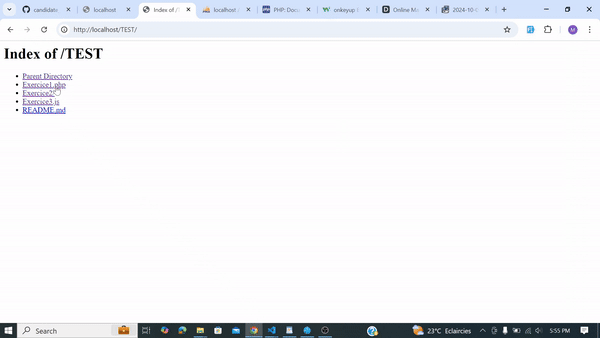

## TEST DE RECRUTEMENT

Ce dossier contient trois exercices réalisés. 
J'utilise PHP 8.2

### Exercice 1 : Calcul du Carré en PHP

Dans cet exercice, un script permet à un utilisateur d'entrer un nombre et de calculer son carré.

#### Logique du Code

1. **Formulaire HTML** : 
   - Un formulaire permet à l'utilisateur de saisir un nombre.

2. **Traitement des Données** :
   - Le script vérifie si le formulaire est soumis via `POST`.
   - Il vérifie si le champ `nombre` est rempli et si la valeur saisie est un nombre valide.
   - Si c'est le cas, le carré est calculé et affiché ; sinon, un message d'erreur est montré.

### Exercice 2 : PHP/MySQL

Ce exercice utilise une base de données pour gérer les informations des produits, magasins et fournisseurs, et fait appel à une structure orientée objet.

#### Structure du Projet

- **Classes** : 
  - **`Revenue.php`** : Gère les calculs de chiffre d'affaires.
  - **`StockInfo.php`** : Fournit des informations sur les stocks.
  - **`StockMovement.php`** : Traite les mouvements de stock, y compris les ventes et les achats.
  - **`StockReport.php`** : Gère la génération de rapports sur le stock.

#### Tâches Réaliser

1. Récupérer les informations de stock des produits du fournisseur NUTELLA dans l’enseigne CARREFOUR.
2. Générer le chiffre d’affaires des ventes de HARIBO dans l’enseigne LECLERC en considérant les mouvements de stock négatifs comme des ventes.
3. Mettre à jour le stock du produit 17 pour le magasin 3 après une vente de 200 exemplaires.
4. Produire un tableau pour les mouvements de stock de Super U, incluant :
   - Informations du magasin
   - Informations du produit
   - Quantité du mouvement de stock
   - Chiffre d'affaires généré par le mouvement
   - Date du mouvement

### Exercice 3 : JavaScript

Cet exercice se concentre sur l'interaction utilisateur avec le tableau de mouvements de stock créé dans l'exercice 2.

#### Fonctionnalités

- Création de filtres de recherche dynamiques pour chaque colonne du tableau.
- Utilisation d'une requête Ajax pour permettre à l'utilisateur de modifier l’enseigne consultée.
- Le tableau affiche par défaut les données de Super U.
- Filtrage basé sur la ville, le produit, la quantité, le chiffre d'affaires et la date.

#### Logique du Code

1. **Chargement des Mouvements de Stock** :
   - La fonction `loadStockMovements(enseigne)` est utilisée pour charger les données de l'enseigne sélectionnée via une requête fetch. Les données sont ensuite insérées dans le tableau.

2. **Application des Filtres** :
   - La fonction `applyFilters()` permet de filtrer les lignes du tableau en fonction des valeurs saisies dans les champs de filtre. Chaque ligne est vérifiée pour déterminer si elle correspond aux critères de filtrage.

3. **Événements de Filtre** :
   - Des écouteurs d'événements sont ajoutés sur chaque champ de filtre pour appliquer les filtres en temps réel lors de la saisie de l'utilisateur.

## Execution

